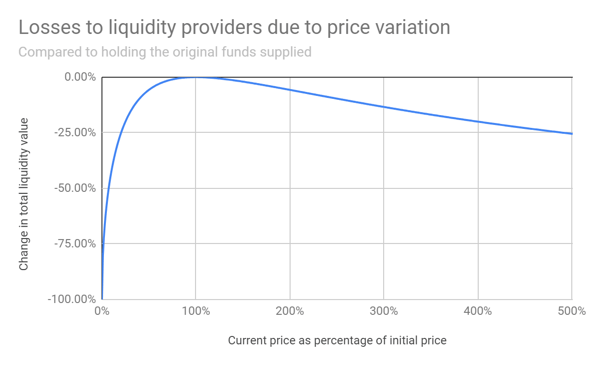

# Impermanent Loss

When a liquidity provider (LP) deposits assets into an Automated Market Maker (AMM), they do so at a 50:50 ratio based on the current value of the assets relative to each other. AMM protocols utilise complex mathematical formulas to adjust the ratios of these underlying assets in the pool while also determining their prices. As the values of assets like BTC and ETH fluctuate, the AMM automatically adjusts the LP's asset ratios to maintain a 50:50 value balance. This process, however, can result in the LP missing out on potential gains if one of the deposited assets outperforms the other.

For this example, let’s assume 1 BTC equals 10 ETH, and 10 ETH equals 1 BTC. The liquidity provider deposits 10 ETH and 1 BTC into an AMM, receiving an LP token as a ‘receipt,’ which can then be used for auto-compounding. If the price of ETH begins to rise due to increased demand, the AMM will automatically adjust the ratio of assets in the pool to maintain a 50:50 value balance between ETH and BTC.

Now 1 BTC is suddenly only worth 5 ETH because of the price jump in ETH. But because the protocol automatically adjusted the amount of tokens in the pool, the farmer lost out on the ETH rally.

This is impermanent loss. If the price of BTC and ETH fluctuate in line with each other then no IL is realised. But if one of the two assets price increases substantially then the farmer loses out.

In the example above the farmer would have been better off simply HODLing their ETH/BTC if they removed their liquidity from the AMM pool.

However, if the farmer stays in the pool and the value of ETH goes back down to its original value then the value of the farmer's overall holdings will go back to the original value also and they would have 10 ETH and 1 BTC.

<figure><figcaption></figcaption></figure>

Keep in mind, impermanent losses only become permanent when you withdraw your liquidity.

## How to protect yourself against IL?

To minimise your exposure, consider providing liquidity for pairs where the relative prices of the assets remain fairly stable, such as a stable coin pair which offers minimal risk of IL.&#x20;

However, the trade-off with these pools is that they offer limited upside from price appreciation, are less common, and often yield lower returns compared to more volatile asset pairs.
